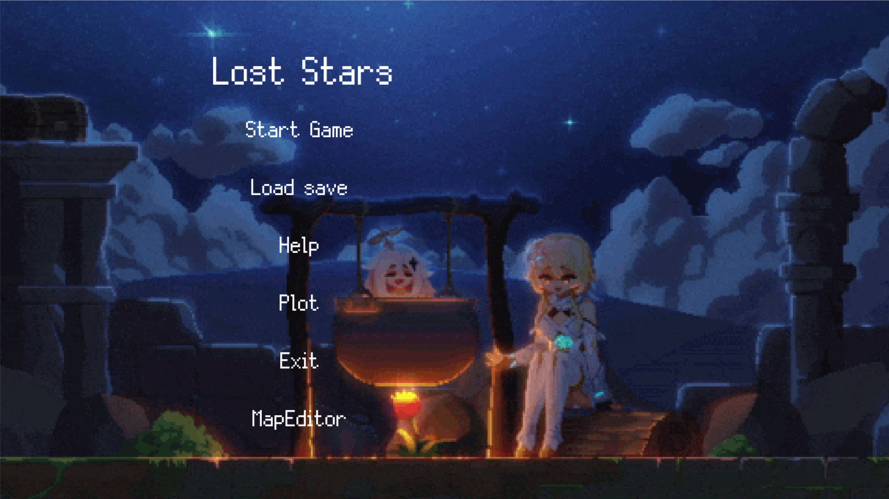
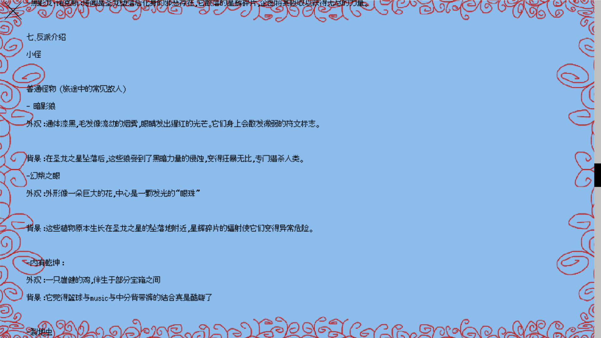
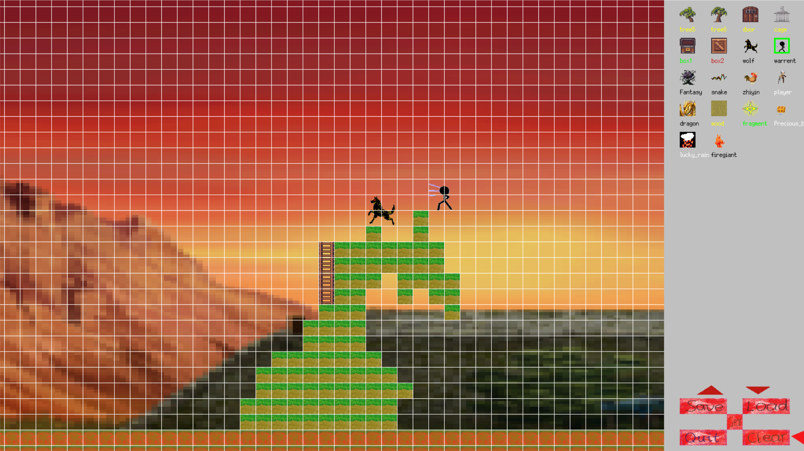
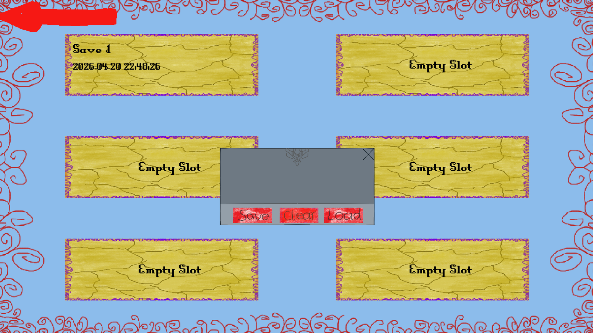
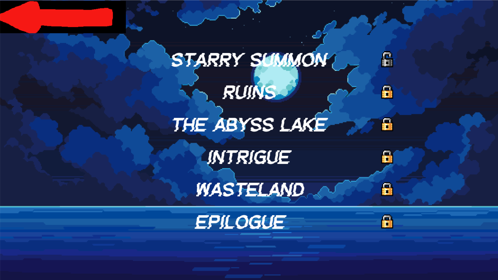
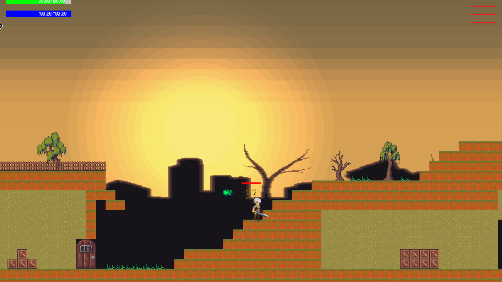
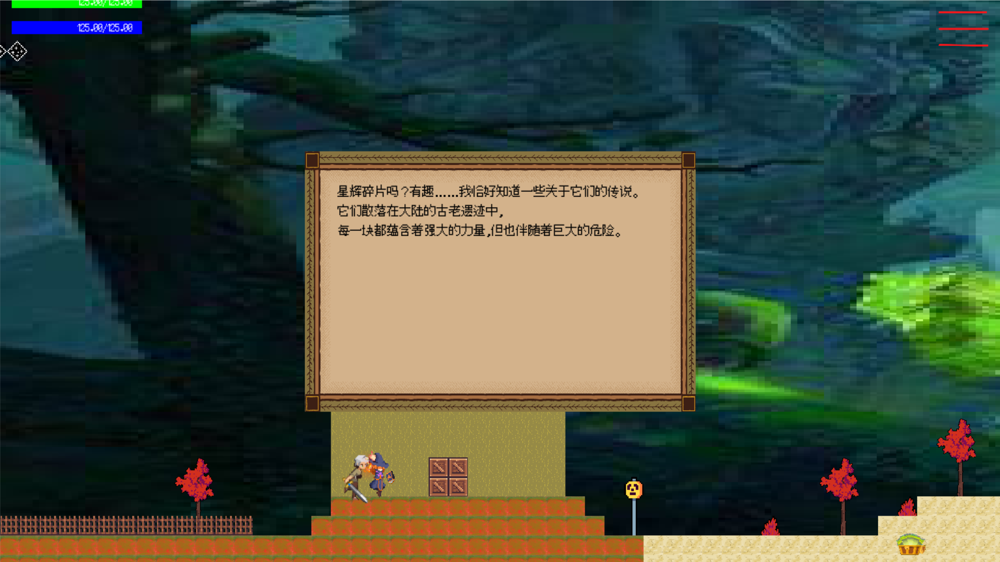
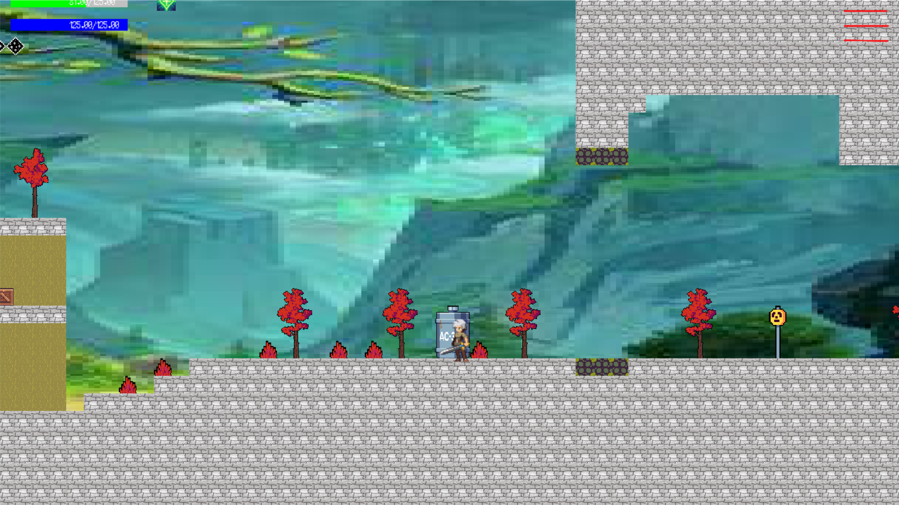
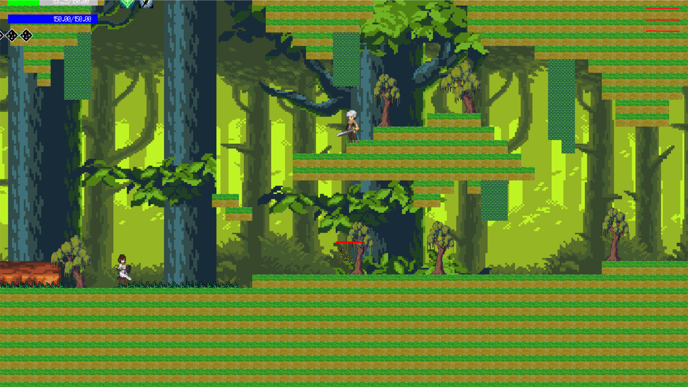

# 🌟 Lost_Stars

## 🚀 运行
- python 3.10.9最佳
```bash
pip install pygame
python main.py
````

---

## 🎮 游戏展示

### 📌 主菜单 / 帮助 / 地图编辑器

  
  
  

---

### 📊 数据 / 存档界面

<div style="display:flex; gap:10px; flex-wrap:wrap;">
  
  
</div>

---

### 🗺️ 关卡

<div style="display:flex; gap:10px; flex-wrap:wrap;">
  
</div>

<div style="display:flex; gap:10px; flex-wrap:wrap;">
  
  
</div>

<div style="display:flex; gap:10px; flex-wrap:wrap;">
  
  
</div>

---

## 🎯 游戏说明

- 一共5关，每关需**击败所有敌人**，到达终点才可以进入下一关,击败**最终BOSS**即可通关
- 默认**一命通关**，若需重开：重新运行项目即可。
- `W / A / S / D`：控制角色移动

---

## 🤝 协作信息

* 协作者：
  [https://github.com/NightRain5212/ECNU2024_pygame](https://github.com/NightRain5212/ECNU2024_pygame)

---

## 📌 声明

* 项目中大多数素材来源于公共资源，仅用于学习与开发用途

